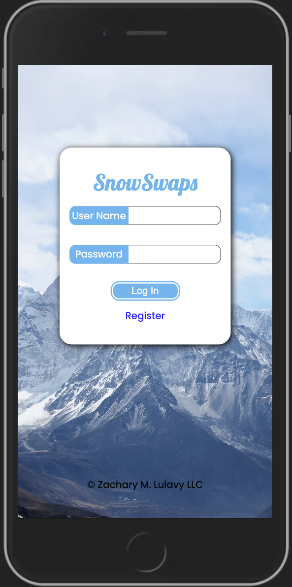
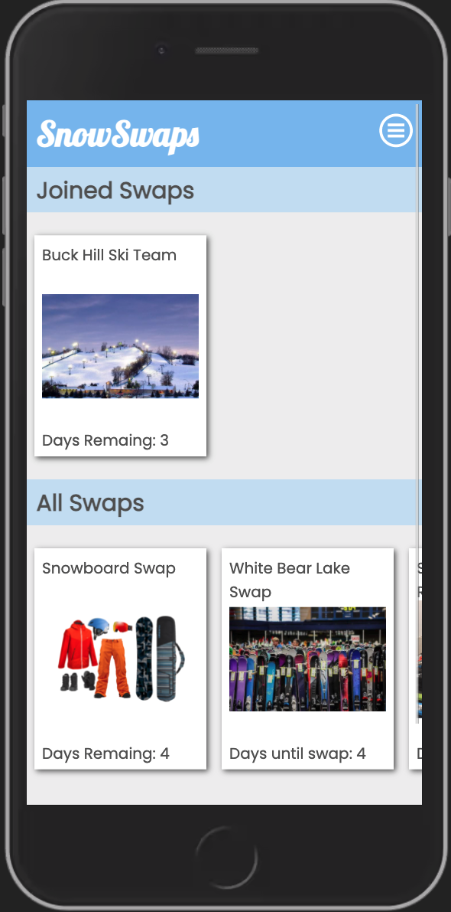
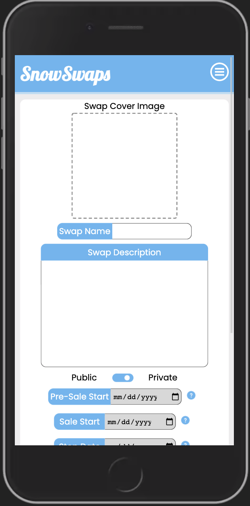
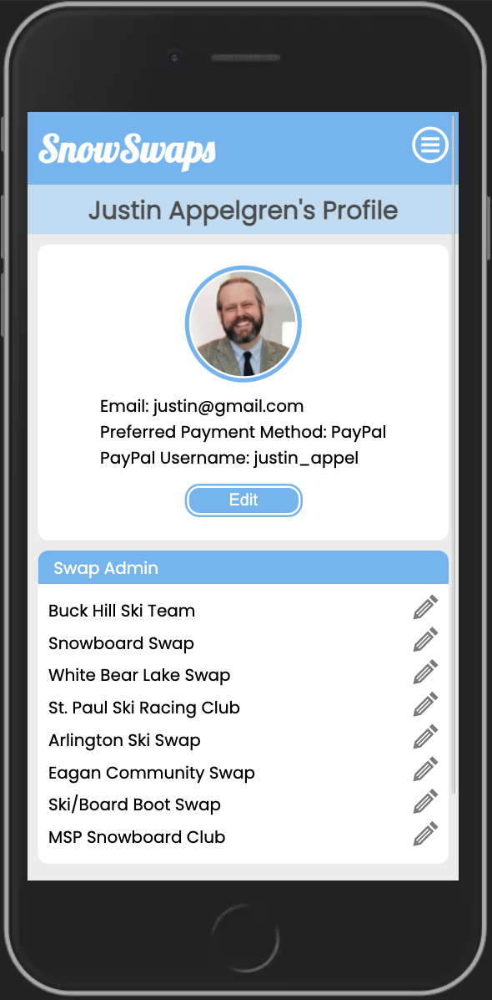
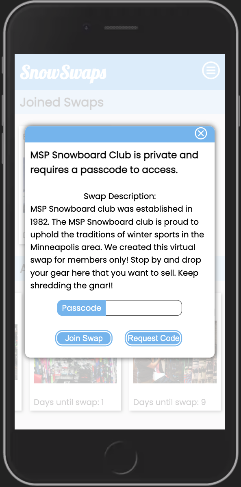
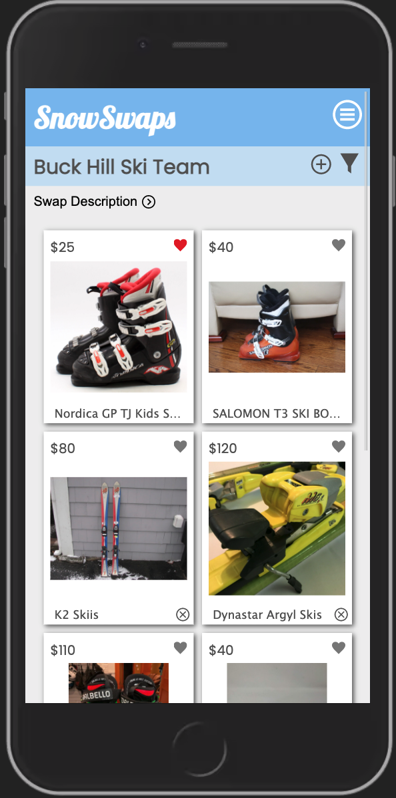
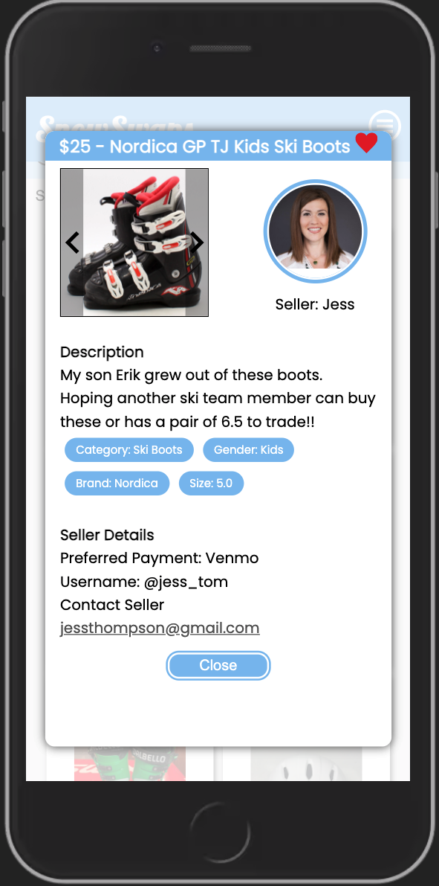

# SnowSwaps
_Duration: 2 Week Sprint_
_Style: 2 Week Sprint_

SnowSwaps is a mobile-friendly online marketplace for members of snow-loving communities to buy, sell, or browse used snow-sport equipment. SnowSwaps bridges the gap between buyers and sellers of used snow sport equipment on a single platform. Members of the App can request permission from SnowSwaps to gain the ability to create virtual “swaps” where users can browse items listed in the swap. Swaps can be public, or they can be private requiring a passcode to interact with the swap. Buyers can contact sellers to negotiate price and a location to meet. 

# Members
  - [Woody Kromar](https://github.com/wkromar)
  - [Collin Radichel](https://github.com/collin-radichel)
  - [Justin Appelgren](https://github.com/jappelgren)
  - [Chris Emerfoll](https://github.com/Emerfoll)
  
## Prerequisites

Before you get started, make sure you have the following software installed on your computer:
  Each software has instructions on the dowload procedure in their website.
- [Node.js](https://nodejs.org/en/)
- [PostrgeSQL](https://www.postgresql.org/)
- [Nodemon](https://nodemon.io/)
- On Mac [Homebrew](https://brew.sh/)
- On Windows [PG Admin 4](https://www.pgadmin.org/download/pgadmin-4-windows/)

## Built With 

Javascript, React, Redux, Node, Express, Material UI, and Passport, NodeMailer, Heroku, 

    
## Development Setup Instructions

- Run `npm install`
- Create a `.env` file at the root of the project and paste these lines into the file:
  ```
  SERVER_SESSION_SECRET=superDuperSecret
  REACT_APP_S3URL=s3BucketURL
  REACT_APP_SERVER=http://localhost:5000
  ```
  While you're in your new `.env` file, take the time to replace `superDuperSecret` with some long random string like `25POUbVtx6RKVNWszd9ERB9Bb6` to keep your application secure. Here's a site that can help you: [https://passwordsgenerator.net/](https://passwordsgenerator.net/). If you don't do this step, create a secret with less than eight characters, or leave it as `superDuperSecret`, you will get a warning.
  
  REACT_APP_S3URL is referencing your s3 bucket, which you will need an account for. Create your account and use the link you recieve to replace `s3BucketURL`
  [AWS S3 Bucket](https://aws.amazon.com/free).
  
REACT_APP_SERVER is referencing whatever URL you are wanting to display the app on. Change it to your desired location.
- Start postgres if not running already by using `brew services start postgresql`
- Run `npm run server`
- Run `npm run client`
- Navigate to `localhost:3000`


## Production Build

Before pushing to Heroku, run `npm run build` in terminal. This will create a build folder that contains the code Heroku will be pointed at. You can test this build by typing `npm start`. Keep in mind that `npm start` will let you preview the production build but will **not** auto update.

- Start postgres if not running already by using `brew services start postgresql`
- Run `npm start`
- Navigate to `localhost:5000`

Directory Structure:

- `src/` contains the React application
- `public/` contains static assets for the client-side
- `build/` after you build the project, contains the transpiled code from `src/` and `public/` that will be viewed on the production site
- `server/` contains the Express App

This code is also heavily commented. We recommend reading through the comments, getting a lay of the land, and becoming comfortable with how the code works before you start making too many changes. If you're wondering where to start, consider reading through component file comments in the following order:

- src/components
  - App/App
  - Footer/Footer
  - Nav/Nav
  - AboutPage/AboutPage
  - InfoPage/InfoPage
  - UserPage/UserPage
  - LoginPage/LoginPage
  - RegisterPage/RegisterPage
  - LogOutButton/LogOutButton
  - ProtectedRoute/ProtectedRoute

## Deployment

### Heroku Prerequisite

1. Sign up for an account on [Heroku.com](https://www.heroku.com/)
2. Install Heroku CLI by typing `brew tap heroku/brew && brew install heroku` in Terminal

- [Additional installation notes and troubleshooting](https://devcenter.heroku.com/articles/heroku-cli#download-and-install)

> Note: Your project also needs to have a git repository.

Run the following commands from within your project folder.

1. Authenticate by typing `heroku login` in Terminal
2. In terminal, navigate to your project folder and type `heroku create`
3. Type `git remote -v` to ensure it added successfully
4. In terminal, type `git push heroku main`
5. You will need to add a MONGO_URI to your config env on heroku.

## Authors 

  - [Chris Emerfoll](https://github.com/Emerfoll)
  - [Collin Radichel](https://github.com/collin-radichel)
  - [Justin Appelgren](https://github.com/jappelgren)
  - [Woody Kromar](https://github.com/wkromar)
 
## Acknoweldgments

  - Prime Digital Academy for teaching us Full-Stack Development
  - Dane Smith for helping troubleshoot problems
  - Zach Lulavy for concept and leadership

## Screenshots
# Login

# Landing Page

# Create Swap

# Admin Profile

# Private

# Swap Items

# Item Details

